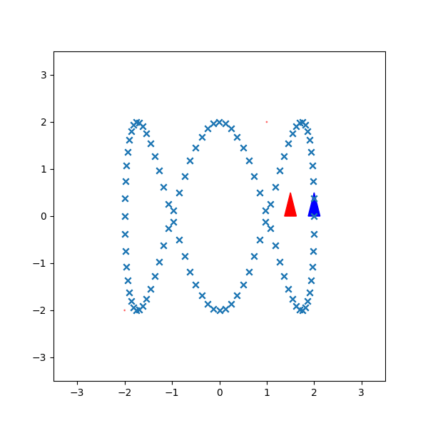
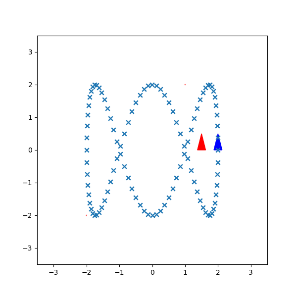
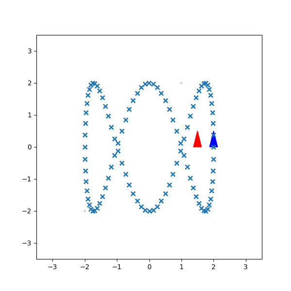
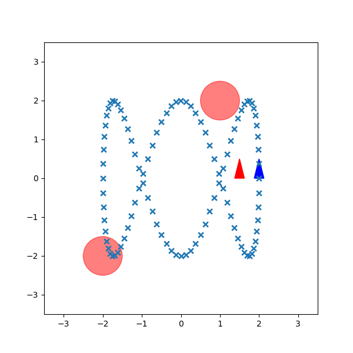

# CEC Controller:
* Terminal cost: 0
* horizon length: 10
* Gamma: 0.9
* reference trajectory and angle needed for few steps
* We have to estimate the v and w
* timestep given
* error for current timestep defined
* need a function to calculate error for future timesteps - no need
* Q, q and R to be estimated by us - **IMP**
* Check once explanation of the stage cost function $\implies$ what is the argument, range and domain of the function
* And how is the stage cost expression derived (intuition) - Simple penalization on errors
* Effectively solve the non-linear optimization problem using CASADI
* Get a range of values for the control inputs with appropriate constraints
* Don't know the what the bound **h** represents in the problem statement

## Supplementary functions:
**NOT NEEDED FOR NOW**
* function to calculate error for future timesteps
* function to calculate stage cost

## Implementation:
* controller is present in every iteration of main loop
* in the controller function, we have iterate to obtain the error for future timesteps
* For this we need the control from future timesteps
* Assign the control as a matrix where the value is 0 for future timesteps
* Now we can iterate for the error function for future timestamps including the variable to be optimized
* How to iterate?
* When horizon 1, no problem
* When horizon 2; $p_2$ would be in terms of $p_1$ and $u_1$ and $u_1$ is a variable.
* Obejctive function when horizon is 2:
$$
\min_{u_1,u_2} \quad [p_1^TQp_1 + u_1^TRu_1 + q(1-\cos{\tilde{\theta}_1})^2 + \gamma (q(1-\cos{\tilde{\theta}_2})^2 + p_2^T Q p_2 + u_2^T R u_2)] \\
= \min_{u_1} \quad [p_1^TQp_1 + u_1^TRu_1 + q(1-\cos{\tilde{\theta}_1})^2] + \min_{u_1,u_2} \quad [\gamma (q(1-\cos{\tilde{\theta}_2})^2 + p_2^T Q p_2 + u_2^T R u_2)] \\
= p_1^TQp_1 + q(1-\cos{\tilde{\theta}_1})^2 + \min_{u_1} [u_1^TRu_1 + \gamma p_2^T Q p_2 + \gamma q(1-\cos{\tilde{\theta}_2})^2] + \gamma \min_{u_2} [u_2^T R u_2] \\
p_2 = p_1 + G(p_1) u_1 
$$
* Now let us consider the case when horizon is 3: Done
* Implemented in the script (For now seems to work without bugs)
* But still not getting desirable results even on tuning (look into it).
* Try incorportaing the collision detection in the contraints.
* when removed lbx and ubx from below code and put them in constraints; does not look like it is working
* it goes straight line, no penalization in the angle
* Current controller working as required 
* Tuning not yet done and not yet figured out how will the trajectory change with the change in weights.
* Something else also could be wrong instead of just tuning
* Implementation was not accurate
* Now it is working as required
* Now only tuning is left including the horizon <---------------------------------------------
* No need to add the limits of velocity and angular velocity in the constraints; can be directly defined in lbx, ubx
* Still need to add the collision avoidance in the constraints
* For now horizon 10 is best (without obstacle case), if less, than once catches up and drifts again, if more always drifts towards the future, couldn't catch. (nothing better than 10)
* 


## Almost done; few bugs to fix:
* Terminal cost not yet define
* Get a hang of the casadi variables and their indices - Done
* Currently control variable is giving problem - Consider the complete vector while optimization;
not consider one after other
* Remember optimization variable should be vector

## Rough:

* We are the minimizing the cost function
* If Q is more $\implies$ we are penalizing the postion error more
* If q is more $\implies$ we are penalizing the angle error more (using cos)
* Since, the error in control does not exist, R represents how much freedom we are giving to the control

## Tuning:
| Q | R | q | gamma | Horizon | Result |
|---|---|---|---|---|---|
| I | 1,0.1 | 10 | 1 | 10 |  |
| I | 1,0.1 | 1000 | 1 | 10 |  |
| I | 1,0.001 | 1000 | 1 | 10 |  |
| 10,1 | 1,0.1 | 1000 | 1 | 10 |  |
| 1,10 | 1,0.1 | 1000 | 1 | 10 |  |
| 10,100 | 1,0.1 | 1000 | 1 | 10 |  |
| 0.3,3 | 1,0.1 | 1000 | 1 | 10 |  |
| 0.4,4 | 10,1 | 1000 | 1 | 10 |  |
| 0.4,4 | 5,1 | 1000 | 1 | 10 |  |
| 3.5,7 | 8,0.1 | 5000 | 0.7 | 15 |  |


* baseline looks like curve rotated a bit and little short in height
* On increasing q size of the outer loop increased; but curve much tilted; 
logic and understanding are correct but the time at of time correction looks delayed resulting in the tilted curve
* No use in decreasing the $\omega$ component in R than 0.1; can't get noticeable difference (compared baseline obstacle avaoidance)
* On increasing x component of Q, it tries to follow the x-corrdinate as close as possible (as expected);
But now y component error increased
* On increasing only y component of Q, we got the loop heights as required but the intersections are still displaced
* Got the best for now when scaled Q and R a little; although it is converging a little late and the intersection are still off by little bit
* Problem of late convergence solved by decreasing gamma; it is focusing more on current trajectories than the future ones


## Current Working code:

### Controller works but not tuned:
.
```python
def CEC(curr_state, ref_state, time_step, horizon, gamma, cur_iter, sim_time):

    ref_state = DM(ref_state)
    curr_state = DM(curr_state)
    curr_state = curr_state.T
    
    # Cost parameters
    Q = DM(np.array([[1, 0],[0, 1]])) * 1
    R = DM(np.array([[1, 0],[0, 0.1]])) * 1
    q = 1

    vmax = 1
    wmax = 1
    vmin = 0
    wmin = -1

    size = int(min(horizon, sim_time - cur_iter))# int(horizon - cur_iter)

    lbx = vertcat(repmat([0, -1], size, 1))
    ubx = vertcat(repmat([1, 1], size, 1))

    counter = cur_iter

    controls = MX.sym('x', size, 2)
    controls_vec = controls.reshape((2 * size, 1))

    # constr1 = controls_vec[0::2] <= vmax
    # constr2 = controls_vec[0::2] >= vmin
    # constr3 = controls_vec[1::2] <= wmax
    # constr4 = controls_vec[1::2] >= wmin

    # constraint = vertcat(constr1, constr2, constr3, constr4)

    objective = 0
    objective = DM(objective)

    error = curr_state - ref_state[counter,:]
    
    objective += (error[:2] @ Q @ error[:2].T) + (q * (1 - cos(error[2]))**2)

    while counter < (size + cur_iter - 1):
        
        if (counter - cur_iter) == 0:

            objective += controls_vec[(counter - cur_iter):(counter - cur_iter)+2].T @ R @ controls_vec[(counter - cur_iter):(counter - cur_iter)+2]
            
            new_angle = np.float64(error[2] + ref_state[counter, 2])

            G = np.array([[time_step * np.cos(new_angle), 0],
                          [time_step * np.sin(new_angle), 0], 
                          [0, time_step]])
            G = DM(G)

            p = error + (G @ controls_vec[(counter - cur_iter):(counter - cur_iter)+2]).T 
            + (ref_state[counter, :] - ref_state[counter + 1, :])

        else:

            objective += ((p[:2] @ Q @ p[:2].T + (q * (1 - cos(p[2]))**2)) * (gamma**(counter - cur_iter)))

            objective += ((controls_vec[(counter - cur_iter):(counter - cur_iter)+2].T @ R @ controls_vec[(counter - cur_iter):(counter - cur_iter)+2]) * (gamma**(counter - cur_iter)))
            
            new_angle = p[2] + ref_state[counter, 2]

            G = MX(3,2)
            G[0,0] = time_step * cos(new_angle)
            G[0,1] = 0
            G[1,0] = time_step * sin(new_angle)
            G[1,1] = 0
            G[2,0] = 0
            G[2,1] = time_step
        
            p = p + (G @ controls_vec[(counter - cur_iter):(counter - cur_iter) + 2]).T + (ref_state[counter, :] - ref_state[counter + 1, :])
        
        counter += 1

    nlp = {'x': controls_vec, 'f': objective}#, 'g': constraint}
    solver = nlpsol('solver', 'ipopt', nlp)

    sol = solver(x0 = np.zeros((2 * size, 1)), lbx = lbx, ubx = ubx)

    return np.array(sol['x'][:2])
```

